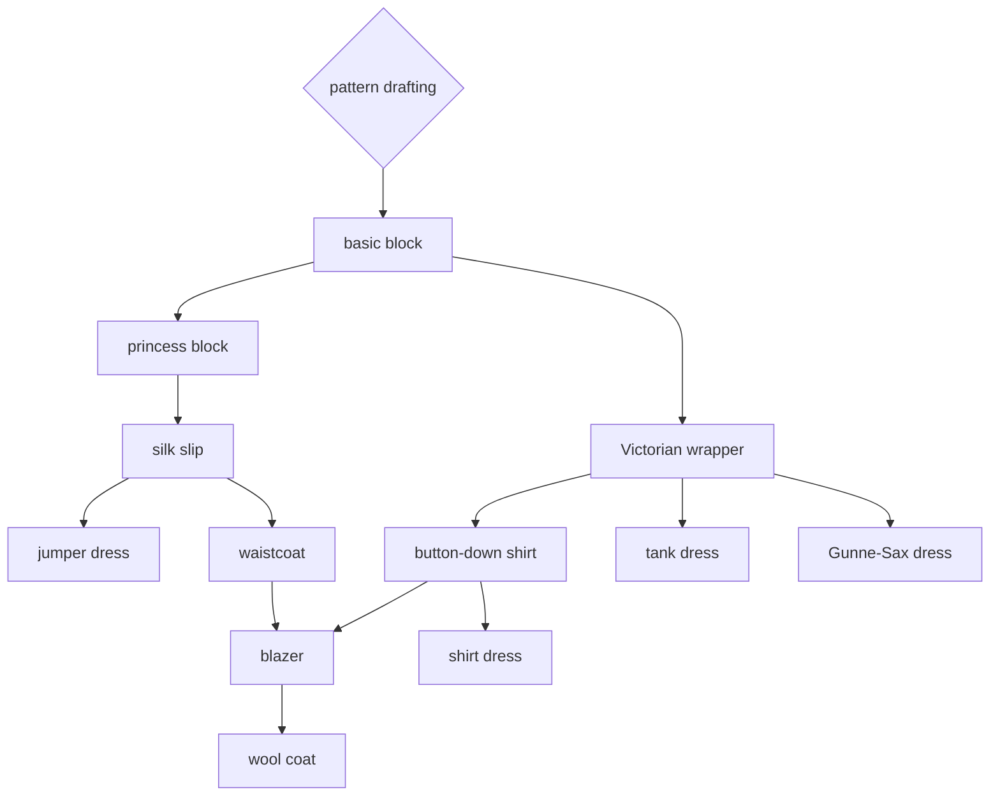

# Philosophy

Clothes that fit well make me look and feel great about myself. My priorities are comfort first, then personal style, then sustainability. Slow fashion gives me an opportunity to grow my skills as a sewist while reducing consumer waste. 

Also, cosplay is fun :)

# Skill Tree

# Roadmap

TBD